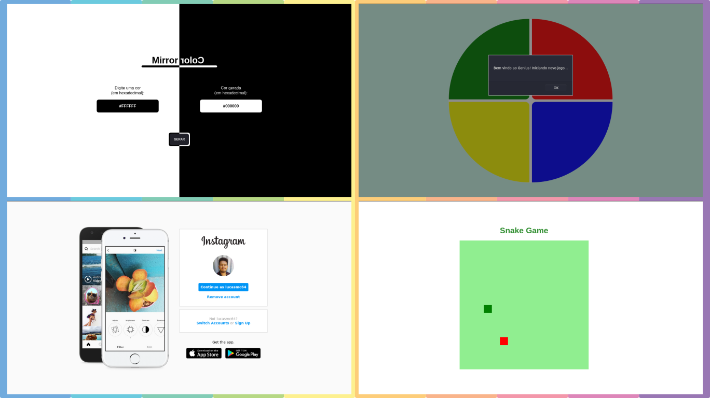

# :alembic: Experiments

This will be a repository dedicated to... that's right, experiments! There is no point in studying hard and not practicing from time to time, is it? Here is going to be a lot of random stuff. *That's it!*

## :memo: License

This project is under the MIT license. See the [LICENSE](LICENSE) for more information.

---

Made with :purple_heart: by Lucas Coutinho :wave: [Get in touch!](https://www.linkedin.com/in/lucasmc64/)