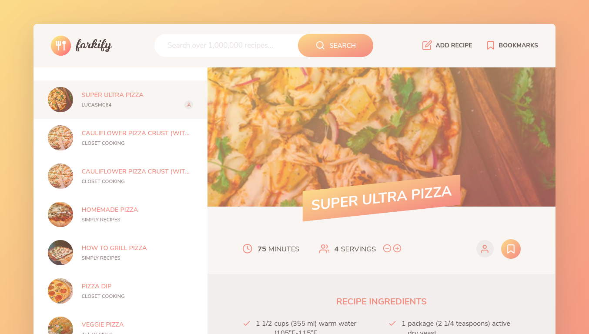
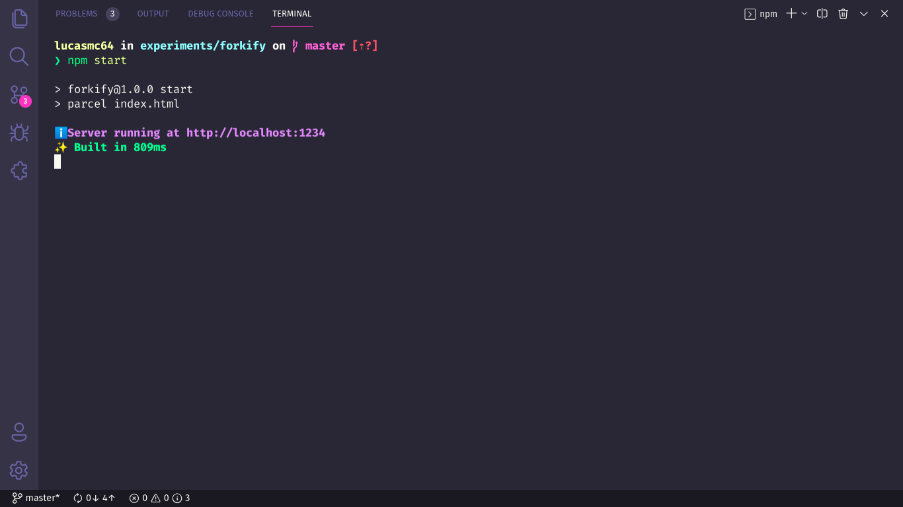

# :shallow_pan_of_food: Forkify Website

## :scroll: Some details

- The front-end is made with HTML5, SASS and JavaScript.

## :thinking: How to run the project on my machine?

The first step is to clone the project, either via terminal or GitHub Desktop, or even by downloading the compressed file (.zip). After that, go ahead.

### :hammer_and_wrench: Requirements

- [Node.JS](https://nodejs.org/).
- (Optional) [Yarn](https://yarnpkg.com/).

### :mag: Installing dependencies

With Node.JS installed, access each project directory via terminal and run the `npm install` command. If you prefer to use Yarn, just run the command `yarn`.

### :sparkles: Running the Frontend

With the dependencies properly installed, still in the terminal, run `npm start` or ` yarn start`. A message similar to the following will appear for you:

Now just access the address _http://localhost:1234_ in your favorite browser, to see the project running.

> If this was not the result, check that the requirements and previous steps have been fulfilled.

## :tada: If everything went well...

Now you are running the project beautifully!

## :memo: License

This project is under the MIT license. See the [LICENSE](LICENSE) for more information.

---

Made with :green_heart: by Lucas Coutinho :wave: [Get in touch!](https://www.linkedin.com/in/lucasmc64/)
