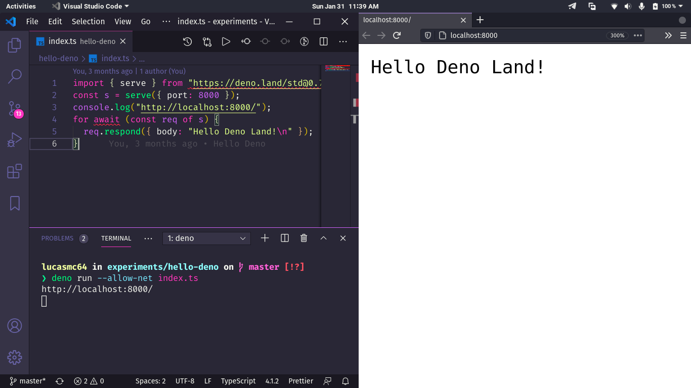

# Dino Game :sauropod:

> :brazil: Caso prefira ler em outra língua, esse README foi escrito também em português. Clique [AQUI](/README_pt-br.md) para acessar.

## Some details :scroll:

* The back end is made with Deno.

## How to run the project on my machine? :thinking:

The first step is to clone the project, either via terminal or GitHub Desktop, or even by downloading the compressed file (.zip). After that, go ahead.

### Requirements :hammer_and_wrench:

* [Deno](https://deno.land/) installed.

### Running the TS file :sparkles:

Open the project folder in the terminal and run the command `deno run --allow-net index.ts`. A link will be shown to access the return from the local server, open it in the browser of your choice.

## If everything went well... :tada:

Now you are running the project beautifully!
