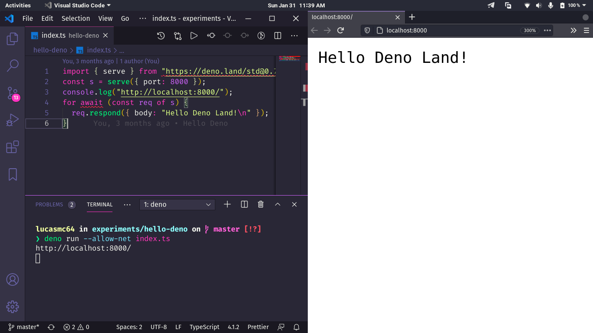

# :sauropod: Dino Game

## :scroll: Some details

- The back end is made with Deno.

## thinking: How to run the project on my machine?

The first step is to clone the project, either via terminal or GitHub Desktop, or even by downloading the compressed file (.zip). After that, go ahead.

### :hammer_and_wrench: Requirements

- [Deno](https://deno.land/) installed.

### :sparkles: Running the TS file

Open the project folder in the terminal and run the command `deno run --allow-net index.ts`. A link will be shown to access the return from the local server, open it in the browser of your choice.

## :tada: If everything went well...

Now you are running the project beautifully!

## :memo: License

This project is under the MIT license. See the [LICENSE](LICENSE) for more information.

---

Made with :brown_heart: by Lucas Coutinho :wave: [Get in touch!](https://www.linkedin.com/in/lucasmc64/)