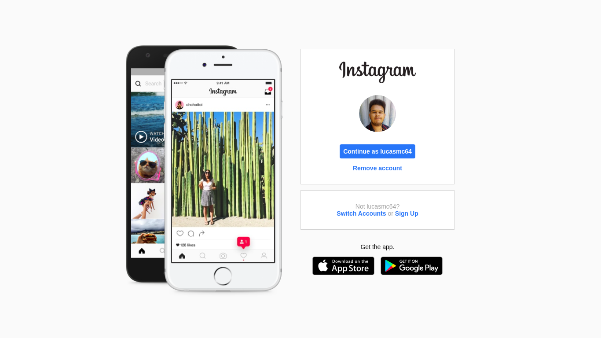

# Landing Page do Instagram

*Esse foi um projeto desenvolvido em um módulo do bootcamp de [HTML Developer](https://web.digitalinnovation.one/track/html-web-developer) da Digital Innovation One (DIO).*

## Objetivo

Praticar os conhecimentos em HTML, CSS e JavaScript.

## Alguns detalhes

Essa página é construisa com somente HTML, CSS e JavaScript.

## Como rodar o projeto na minha máquina

O primeiro passo é clonar o projeto, seja via terminal ou GitHub Desktop, ou mesmo baixando o arquivo compactado (.zip). 

Após isso, basta abrir o arquivo *index.html* no navegador de sua preferência.
