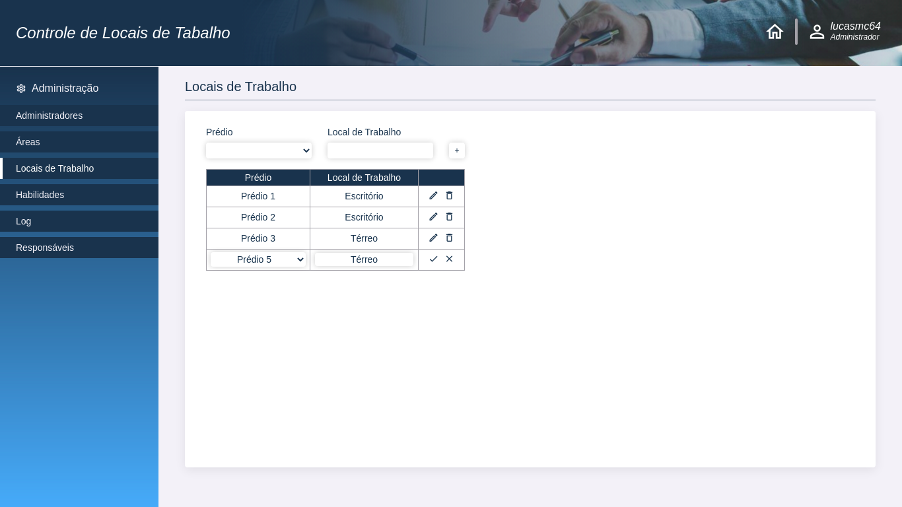

# Controle de Locais de Trabalho :woman_technologist:

*Esse foi um projeto desenvolvido como exercício para vaga de estágio da Obuc.*

## Objetivo :dart:

Com o advento da pandemia e a migração de grande parte dos trabalhos "não essenciais" para o modelo de Home Office, houve uma maior necessidade por ferramentas para o controle dos locais de trabalho de seus funcionárioso.

## Alguns detalhes :scroll:

* O front end é feito com HTML5, CSS3 e JavaScript.

## Como rodar o projeto em minha máquina? :thinking:

O primeiro passo é clonar o projeto, seja via terminal ou GitHub Desktop, ou mesmo baixando o arquivo compactado (.zip). Após isso, siga  adiante.

## Requisitos :hammer_and_wrench:

Não há requisitos para executar o projeto em seu computador! Basta dar dois cliques no arquivo *index.html* que ele será aberto em seu navegador padrão.

## Se tudo deu certo... :tada:

Agora você está o projeto rodando lindamente!