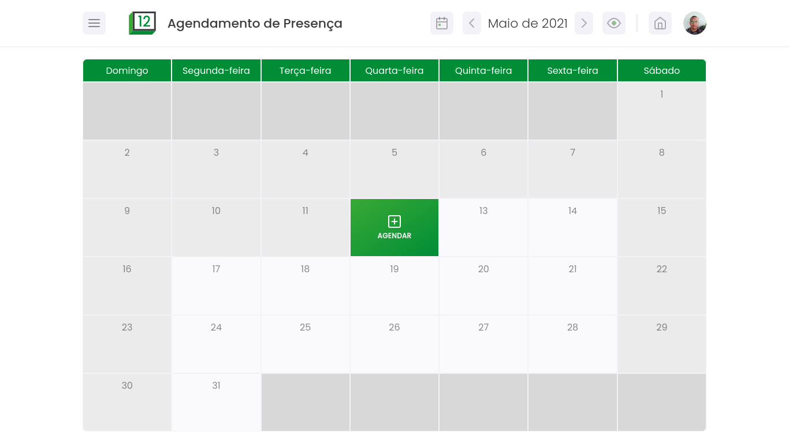

# :date: Presence Scheduling

## :dart: Goal

In order to avoid agglomerations in the pandemic, this project aims to allow you to schedule your presence on a certain day at your workplace, blocking the days that already have many people scheduled.

## :scroll: Some details

- The front-end is made with HTML5, CSS3 and JavaScript.

## :thinking: How do I run the project on my machine?

The first step is to clone the project, either via terminal or GitHub Desktop, or even by downloading the compressed file (.zip). After that, go ahead.

## :hammer_and_wrench: Requirements

There are no requirements to run the project on your computer! Just double click on the _index.html_ file and it will open in your default browser.

## :tada: If everything went well...

Now you are running the project beautifully!

## :memo: License

This project is under the MIT license. See the [LICENSE](LICENSE) for more information.

---

Made with :purple_heart: by Lucas Coutinho :wave: [Get in touch!](https://www.linkedin.com/in/lucasmc64/)