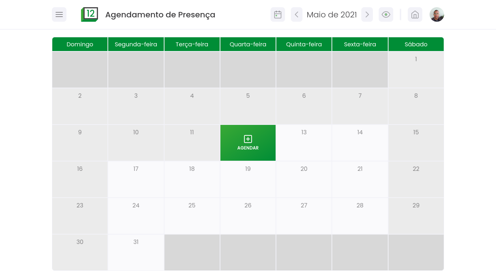

# :date: Agendamento de presença

> :us: If you prefer to read in another language, this README was also written in english. Click [HERE](/README.md) to access.

## :dart: Objetivo

A fim de evitar aglomerações na pandemia, esse projeto visa permitir você agendar sua presença em determinado dia no seu local de trabalho, bloqueando os dias que já possuem muitas pessoas agendadas.

## :scroll: Alguns detalhes

- O front end é feito com HTML5, CSS3 e JavaScript.

## :thinking: Como rodar o projeto em minha máquina?

O primeiro passo é clonar o projeto, seja via terminal ou GitHub Desktop, ou mesmo baixando o arquivo compactado (.zip). Após isso, siga adiante.

## :hammer_and_wrench: Requisitos

Não há requisitos para executar o projeto em seu computador! Basta dar dois cliques no arquivo _index.html_ que ele será aberto em seu navegador padrão.

## :tada: Se tudo deu certo...

Agora você está o projeto rodando lindamente!
