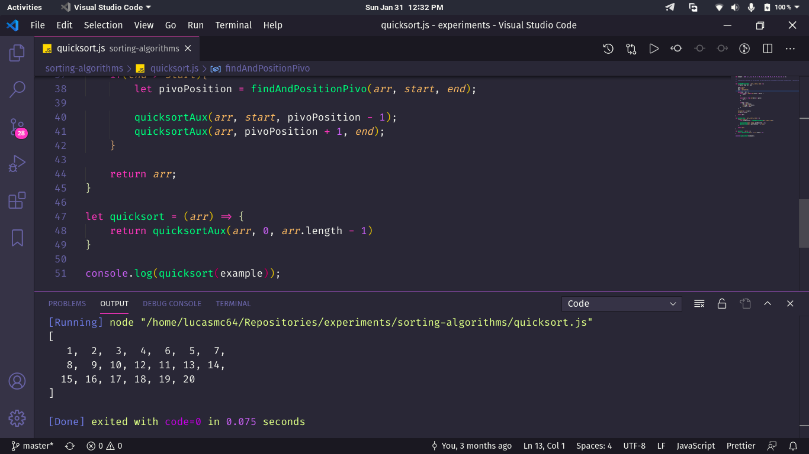

# Sorting Algorithms :sauropod:

> :brazil: Caso prefira ler em outra língua, esse README foi escrito também em português. Clique [AQUI](/README_pt-br.md) para acessar.

## Some details :scroll:

* The algorithms are made with JavaScript.

## How to run the project on my machine? :thinking:

The first step is to clone the project, either via terminal or GitHub Desktop, or even by downloading the compressed file (.zip). After that, go ahead.

### Requirements :hammer_and_wrench:

* [Node.JS](https://nodejs.org/) installed.
* [VSCode](https://code.visualstudio.com/) and the extension [Node.js Exec](https://marketplace.visualstudio.com/items?itemName=miramac.vscode-exec-node) installed.

### Running the JS files :sparkles:

Open the project folder in VSCode and, by right-clicking on the file with extension *.html*, choose *Run Code*. The Node output console will open with the code results.

## If everything went well... :tada:

Now you are running the project beautifully!
