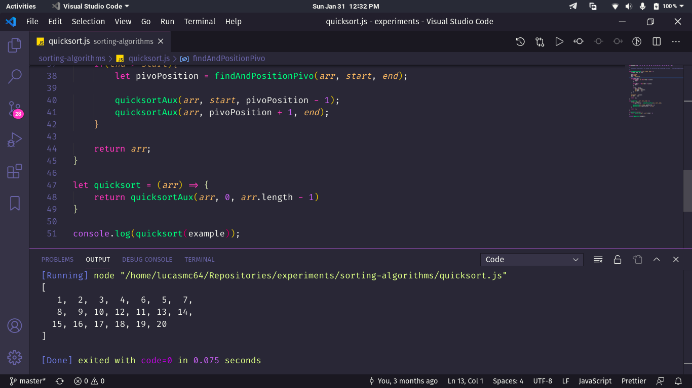

# :sauropod: Sorting Algorithms

## :scroll: Some details

- The algorithms are made with JavaScript.

## :thinking: How to run the project on my machine?

The first step is to clone the project, either via terminal or GitHub Desktop, or even by downloading the compressed file (.zip). After that, go ahead.

### :hammer_and_wrench: Requirements

- [Node.JS](https://nodejs.org/).
- [VSCode](https://code.visualstudio.com/) and the extension [Node.js Exec](https://marketplace.visualstudio.com/items?itemName=miramac.vscode-exec-node).

### :sparkles: Running the JS files

Open the project folder in VSCode and, by right-clicking on the file with extension *.html*, choose *Run Code*. The Node output console will open with the code results.

## :tada: If everything went well...

Now you are running the project beautifully!

## :memo: License

This project is under the MIT license. See the [LICENSE](LICENSE) for more information.

---

Made with :yellow_heart: by Lucas Coutinho :wave: [Get in touch!](https://www.linkedin.com/in/lucasmc64/)