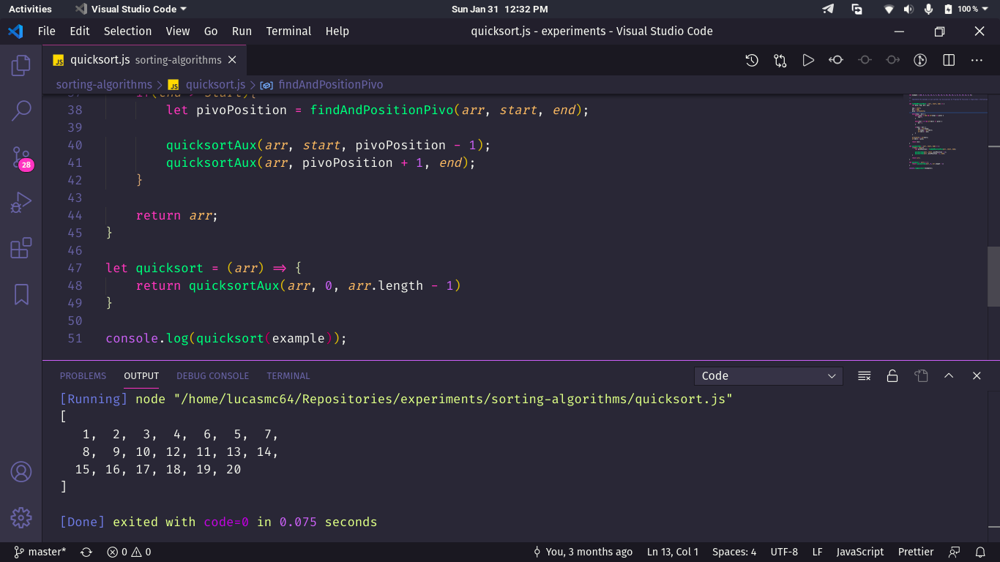

# Algoritmos de Ordenação :sauropod:

> :us: If you prefer to read in another language, this README was also written in english. Click [HERE](/README.md) to access.

## Alguns detalhes :scroll:

* Os algoritmos são feitos com JavaScript.

## Como rodar o projeto em minha máquina? :thinking:

O primeiro passo é clonar o projeto, seja via terminal ou GitHub Desktop, ou mesmo baixando o arquivo compactado (.zip). Após isso, siga  adiante.

### Requisitos :hammer_and_wrench:

* [Node.JS](https://nodejs.org/) instalado.
* [VSCode](https://code.visualstudio.com/) e a extensão [Node.js Exec](https://marketplace.visualstudio.com/items?itemName=miramac.vscode-exec-node) instalados.

### Rodando os arquivos JS :sparkles:

Abra a pasta do projeto no VSCode e, clicando com o botão direito sobre o arquivo com extensão *.html*, escolha *Run Code*. O console de saída do Node se abrirá com os resultados do código.

## Se tudo deu certo... :tada:

Agora você está o projeto rodando lindamente!
