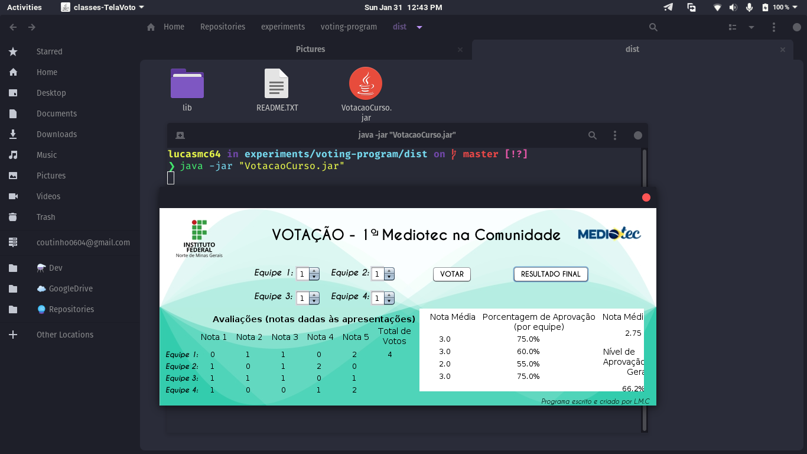

# :raising_hand: Voting

## :scroll: Some details

- The back end is made with Java.

## :thinking: How to run the project on my machine?

The first step is to clone the project, either via terminal or GitHub Desktop, or even by downloading the compressed file (.zip). After that, go ahead.

### :hammer_and_wrench: Requirements

- [JDK8](https://www.oracle.com/java/technologies/javase/javase-jdk8-downloads.html) installed.
- [Netbeans](https://netbeans.org/) installed.

### :sparkles: Running the project

Open the project folder in Netbeans and click the *Build and run* button. The files will be compiled and the program will open.

## :tada: If everything went well...

Now you are running the project beautifully!

## :memo: License

This project is under the MIT license. See the [LICENSE](LICENSE) for more information.

---

Made with :white_heart: by Lucas Coutinho :wave: [Get in touch!](https://www.linkedin.com/in/lucasmc64/)