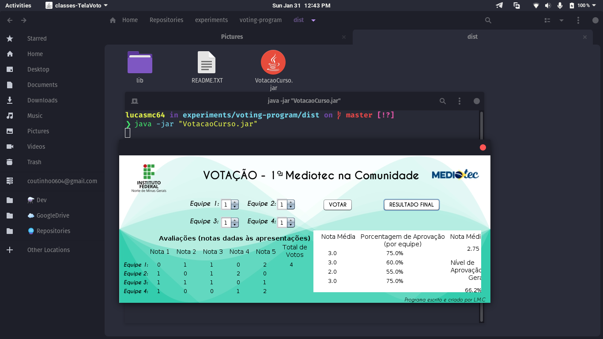

# Votação :raising_hand:

> :us: If you prefer to read in another language, this README was also written in english. Click [HERE](/README.md) to access.

## Alguns detalhes :scroll:

* O back end é feito com Java.

## Como rodar o projeto em minha máquina? :thinking:

O primeiro passo é clonar o projeto, seja via terminal ou GitHub Desktop, ou mesmo baixando o arquivo compactado (.zip). Após isso, siga  adiante.

### Requisitos :hammer_and_wrench:

* [JDK8](https://www.oracle.com/java/technologies/javase/javase-jdk8-downloads.html) instalado.
* [Netbeans](https://netbeans.org/) instalado.

### Rodando o programa :sparkles:

Abra a pasta do projeto no Netbeans e clique no botão *Build and run*. Os arquivos serão compilados e o programa se abrirá.

## Se tudo deu certo... :tada:

Agora você está o projeto rodando lindamente!
